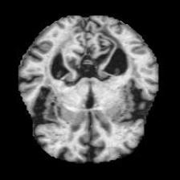
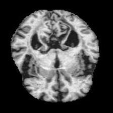

# Alzheimer’s classification based on augmented MRIs using a convolutional neural network

A convolutional neural network built in PyTorch that classifies brain MRI slices into four stages of
Alzheimer's-related dementia. It includes a full pipeline: preprocessing, data augmentation, class-imbalance
handling, Bayesian hyperparameter search with Weights & Biases, and per-class test evaluation. See the [abstract](Abstract.pdf).

| Class | Train images | Test images |
|---|---:|---:|
| NonDemented | 2,560 | 640 |
| VeryMildDemented | 1,792 | 448 |
| MildDemented | 717 | 179 |
| ModerateDemented | 52 | 12 |

The dataset is heavily imbalanced (ModerateDemented makes up about 1% of the data), and much of the design
is about dealing with that.

## Approach

- **Preprocessing:** Images are converted to RGB and resized to 224×224 ([src/data.py](src/data.py)).
- **Augmentation:** 10% extra training samples are created with random rotation, horizontal flip, affine
  shift/scale/shear, and brightness/contrast jitter. Only the training split is augmented, and the
  80/20 validation split remains.

  | Original (resized) | Augmented |
  |---|---|
  |  |  |

- **Model:** A custom CNN ([src/model.py](src/model.py)) with a conv stem, four convolutional blocks
  (two 3×3 convs → BatchNorm → max-pool, 32→256 channels), and three fully connected blocks with BatchNorm and
  heavy dropout (0.7 / 0.5 / 0.3). See the [architecture diagram](assets/model_architecture.svg)
- **Class imbalance:** Cross-entropy loss weighted by inverse class frequency.
- **Training & tuning:** Bayesian sweep over learning rate, batch size, epochs, and optimizer (Adam / SGD with
  momentum), maximizing validation multiclass AUROC. The best checkpoint per run is saved and logged to W&B
  ([src/checkpoint.py](src/checkpoint.py))
- **Evaluation:** Overall accuracy, per-class accuracy, and a confusion matrix on the held-out test set
  ([src/evaluate.py](src/evaluate.py))
- **Binary mode:** `--binary` compares NonDemented vs. Demented

## Project structure

```
├── main.py              # CLI: preprocess / train / sweep / evaluate
├── src/
│   ├── data.py          # image loading, labels, train/val split, augmentation
│   ├── model.py         # CNN architecture
│   ├── train.py         # training + validation loop with W&B logging
│   ├── evaluate.py      # test-set metrics
│   └── checkpoint.py    # keeps the best model by validation AUROC
├── scripts/
│   └── visualize.py     # augmentation example, architecture diagram, ONNX export
├── assets/              # figures used in this README
└── data/{train,test}/<class>/*.jpg
```

## Data

The images aren't included in this repo but were downloaded from the [OASIS dataset](https://sites.wustl.edu/oasisbrains/home/oasis-1/) and placed in the `data` folder as such.

```
data/
├── train/
│   ├── MildDemented/
│   ├── ModerateDemented/
│   ├── NonDemented/
│   └── VeryMildDemented/
└── test/
    └── (same four folders)
```

## Usage

```bash
pip install -r requirements.txt
wandb login

python main.py preprocess                      # cache resized + augmented tensors to data/processed.pt
python main.py train --lr 5e-5 --epochs 50     # single training run
python main.py sweep --count 30                # Bayesian hyperparameter sweep
python main.py evaluate models/*.pt            # test accuracy, per-class accuracy, confusion matrix
```

Add `--binary` before the subcommand (e.g. `python main.py --binary preprocess`) for the two-class task.
